# Computer Networks III
| Inhoudstafel  |
| :---  |
| [SRWE](#srwe)
| 14.[Routing Concepts](#module-14-routing-concepts)    |
| 15.[Ip Static Routing](#module-15-ip-static-routing)  |
| 16.[Troubleshoot Static and Default Routes](#module-16-troubleshoot-static-and-default-routes) |
| [ENSA]()  |
| 1.[Single-Area OSPFv2 Concepts](#module-1-single-area-ospfv2-concepts) |
| 2.[Single-Area OSPFv2 Configuration](#module-2-single-area-ospfv2-configuration)    |
| 4.[ACL Concepts](#module-4-acl-concepts) |
| 5.[ACL for IPv4 Configuration](#module-5-acl-for-ipv4-configuration) |
| 6.[NAT for IPv4](#module-6-nat-for-ipv4) |
# SRWE
# Module 14: Routing Concepts
## 14.1 Path Determination
### 14.1.1 De 2 functies van een Router
- De 2 primaire functies van een router:
  - het beste pad vastleggen voor het forwarden van pakketten obv de informatie uit de routing tabel
  - het forwarden van de pakketten naar hun bestemming

### 14.1.3 Het beste pad is gelijk aan het langste match
- Het beste pad is de langste match in de routing tabel
- de routing tabel bevat de route entries d

### 14.1.6 Het opmaken van de Routing Tabel
- Direct geconnecteerde netwerken:
- Remote netwerken
- Standaard route

## 14.2 Packet Forwarding
### 14.2.1 Packet Forwarding Decision Process
1. De data link frame met de geëncapsuleerde IP pakket komt aan op de ingress interface
2. De router examineert de bestemmings IP adres in de pakket header en bekijkt de IP routing tabel
3. De router zoekt de langste match prefix in de tabel
4. De router encapsuleert de pakket in een data link frame en forward dit via de egress interface
   
- achter het beslissen van het beste pad, kan de router het volgende doen
  - Het pakket forwarden op een apparaat die direct geconnecteerd is het op netwerk
  - het pakket forwarden naar een Next-Hop Router
  - Het pakket droppen - er is geen match in de Routing Tabel

### 14.2.2 Packet Forwarding Mechanisms
- de primaire verantwoordelijkheid van de pakket forwarding functie is het encapsuleren van pakketten in juist appro data link frame type voor de uitgaande interface
- De Router ondersteunt de volgende 3 pakket forwarding mechanismen
  - Process switching
  - Fast switching
  - Cisco Express Forwarding (CEF)
- **Process Switching**:
  - een ouder pakket forwarding mechanisme
  - wanneer een pakket arriveert op een interface, wordt deze doorgestuurd naar een control paneel waar de CPU het bestemmingsadres matcht met een entry in zijn Routing Tabel. Daarna bepaald hij de exit interface en forward het pakket.
  - De router doet dit voor alle pakketten, zelfs als de bestemming in dezelfde stream aan pakketten zit.

- **Fast Switching**:
  - ouder maar beter mechanisme dan Process Switching
  - gebruikt een fast-switching cache om de next-hop informatie in op te slaan
  - wanneer een pakket arriveert op een interface, dan wordt het doorgestuurd naar de control plane waar de CPU zoekt voor een match in de fast-switching cache.
  - als het niet hier is, dan wordt het geprocess-switched

- **Cisco Express Forwarding (CEF)**:
  - het meeste recente en standaard Cisco IOS packet forwarding mechanisme
  - CEF maakt een Forwarding Information Base (FIB) en een aangrenzende tabel
  - de tabellen entries zijn niet packet-triggered zoals bij Fast Switching => maar change-triggerd (zoals wanneer een verandering is in de netwerk topologie)
  - wanneer een netwerk convergeerd, de FIB en de aangrenzende tabel bevat alle informatie dat een router zou moeten mee rekening houden wanneer hij een pakket zou forwarden
  

## 14.3 Basic Router Configuration Review
### 14.3.1 Topologie
### 14.3.2 Configuratie commando's

### 14.3.3 Verificatie Commando's
- `show ip interface brief`
- `show running-config interface <interface-type number>`
- `show interfaces`
- `show ip interface`
- `show ip route`
- `ping`

### 14.3.4 Filter commando output
- filterting commando's kunnen gebruikt worden om bepaalde uitput te krijgen, hiervoor hebt je | pipe karakter nodig
- bepaalde filter parameters
  - section
  - include
  - exclude
  - begin
## 14.4 IP Routing Table
### 14.4.1 Route Sources
- een routing tabel bevat een lijst aan routes 
- de bron van deze informatie komt van:
  - Direct geconnecteerde netwerken
  - statische routes
  - dynamische routing protocollen
- de bron van iedere route in de tabel is geïdentificeerd met een code:
  - **L**: identificeert een adres vastgelegd aan een router interface
  - **C**: identificeert een direct geconnecteerd netwerk
  - **S**: identificeert een statische route die gemaakt is om een specifiek netwerk te reachen
  - **O**: identificeert een dynamisch geleerd netwerk van een andere router door gebruik te maken van OSPF routing protocol
  - *: deze route is een kandidaat voor een standaard route

### 14.4.2 Routing tabel principes
- 3 routing table principes
  - iedere router maakt een beslissing alleen, gebaseerd op de informatie dat hij heeft in zijn eigen routing tabel
  - de informatie in een routing tabel van 1 router moet niet direct dezelfde zijn als de routing tabel van een andere router
  - routing informatie over een pad 

### 14.4.3 Routing Table Entries
1. **Route Source**: geeft weer hoe de route geleerd geweest is
2. **bestemming netwerk (prefix en prefix lengte)**: geeft het adres weer van het remote netwerk
3. **administratieve afstand**: geeft de betrouwbaarheid weer van de route bron. Hoe lager de waarde geeft de preferred route bron weer. deze is gebaseerd op welke routing protocol er gebruikt werd
4. **Metric**: geeft de waarde voor . De berekening is gebaseerd op de kost van een bepaalde route
5. **Next-hop**: het ip adres voor de volgende router naar welk het pakket 
6. **Route timestamp**: geeft de tijd weer sinds wanneer de route aangeleerd werd
7. **exit interface**: geeft de egress interface weer dat gebruitk wordt voor uitgaande pakketten om hun finale bestemming te bereiken

### 14.4.4 Directly Connected Networks
- voordat een router kan leren over een remote netwerk, moet deze minstens 1 actieve interface hebben met een IP adres en subnet mask
- dit staat bekend als een direct verbind netwerk of direct geconnecteerde route
- routers kunnen een direct verbinde route toevoegen aan zijn routing tabel wanneer een interface geconfigueerd is met een IP adres en wanneer deze actief is
- heeft als status code 'C'
- de routing tabel kan ook een lokale route bevatten, deze wordt aangeduid met de status code 'L'
- voor IPv4 lokale routes is de prefix lengte /32 en voor IPv6 lokale routes is de prefix lengte /128, dit betekend dat de bestemmings ip adres van het pakket altijd gelijk moet zijn aan de bits in de lokale route

### 14.4.5 Statische routes
- statische routes hebben 2 primaire gebruiken
  - het geeft een gemakkelijk onderhoud van de routing tabel in kleinere netwerken
  - het geeft route van en naar stub netwerken. Een stub netwerk is een netwerk die bereikt wordt door 1 route, en de router heeft enkel maar 1 buur
  - het gebruikt een single default route om het pad naar elk netwerk dat niet 
### 14.4.6 Statische routes in de IP Routing tabel

### 14.4.7 Dynamic Routing Protocols
- Dynamic Routing Protocols worden gebruikt door routers om informatie over de bereikbaarheid en de status van remote networks te delen
- DRP doen verschillende activiteiten zoals:
  - network discovery
  - maintaining routing tables
  - ....
### 14.4.8 Dynamic Routes in the Routing Table

### 14.4.9 Default Route
- De default route specificeert een next-hop router die gebruikt moet worden wanneer de routing table niet de specifieke route heeft dat overeenkomt met de bestemming IP adres
- deze kan ofwel een statische route zijn of een route die aangeleerd werd door Dynamic Routing Protocol
- een default route heeft een IPv4 route entry van 0.0.0.0/0 of een IPv6 route entry van ::/0
### 14.4.10 Structure of an IPv4 Routing Table

### 14.4.11 Structure of an IPv6 Routing Table

### 14.4.12 Administrative Distance
- een route entry voor een specifiek netwerk adres kan alleen maar 1 keer voorkomen in een Routing table
- Cisco IOS maakt gebruikt van Administrative Distance (AD) om te bepalen welke route er geïnstalleerd zal worden in de IP routing table. De AD toont de betrouwbaarheid van de route
- hoe lager de AD, hoe betrouwbaarder de route is

## 14.5 Static and Dynamic Routing
### 14.5.1 Static of Dynamic?
- de meeste netwerken gebruiken een combinatie van de twee
- **Static Routes**
  - Static routes worden het meest gebruikt in volgende scenario's
    - als een default route om pakketten te forwarden naar de ISP
    - voor routes buiten het routing domein en die niet aangeleerd zijn door dynamic routing protocol
    - wanneer een netwerk admin een 
    - voor routing tussen stub netwerken
- **Dynamic Routing**
  - Dynamic routing protocols worden geïmplementeerd in ieder type van netwerk dat bestaat uit 1 of meerdere routers
  - Dynamic Routing protocols zijn schaalbaar en automatisch 
  - Deze worden gebruikt in volgende scenario's:
    - in netwerken dat bestaan uit meer dan 1 routers
    - wanneer er een verandering in de netwerk topologie is
    - voor schaalbaarheid

### 14.5.2 Dynamic Routing Evolution
- Dynamic Routing protocols worden al in netwerken gebruikt sinds 1980s

- 2 soorten
  - IGPs(Interior Gateway Protocols): wordt gebruikt voor het uitwisselen van informatie in 1 routing domein die beheerd wordt door 1 organisatie
  - EGP(Exterior Gateway Protocol): wordt gebruikt voor het uitwisselen van informatie tussen meerdere en verschillende organisatie's, die bekend staan als autonomous systems (AS)
    - wordt vaak gebruikt door ISP om pakketten over het internet te versturen

### 14.5.3 Dynamic Routing Protocol Concepts
- een routing protocol is een set van processen, algoritmen en berichten dat gebruikt wordt voor het uitwisselen van routing informatie en het vullen van de routing table met de keuze voor het beste pad
- de bedoeling van dynamic routing protocols zijn:
  - het ontdekken van remote netwerken
  - het onderhouden van routing informatie
  - het kiezen van het beste pad naar bestemming netwerken
  - de mogelijkheid voor het vinden van een nieuw beste pad als het huidige pad niet meer beschikbaar is
- de belangrijkste onderdelen van dynamic routing protocols zijn:
  - **data structuren**: RP gebruiken vaak tabellen of databanken voor hun operaties. Deze worden opgeslagen in het RAM
  - **Routing Protocol messages**: RP gebruiken verschillende soorten berichten om hun taken te voldoen
  - **algoritme**: een algoritme is een lijst aan steppen om een taak te vervolledigen. RP gebruikt algoritmen om hun taken te doen

### 14.5.4 Best Path
- Het beste pad wordt geselecteerd door een RP gebaseerd op de waarde of metric dat gebruikt wordt om de afstand te bepalen om een netwerk te bereiken

### 14.5.5 Load Balancing
- wanneer een router 2 of meerdere paden heeft met dezelfde metric kost, dan forward de router de pakketten via de beide paden op hetzelfde moment. Dit noemt equal cost load balancing
  - de routing tabel bevat de single destination network, maar heeft meerde uitgang interfaces
  - als het correct geconfigueerd is, load balancing kan effectiviteit en performantie verbeteren van het netwerk
  - equal cost load balancing wordt automatisch geïmplementeerd door dynamic routing protocol. Het wordt aangezet met static routes wanneer er meerdere static routes naar hetzelfde netwerk zijn

# Module 15: IP Static Routing
## 15.1 Static Routes
### 15.1.1 Types of Static Routes
- Static routes worden vaak geïmplementeerd op een netwerk, dit is zo zelfs als er een dynamic routing protocol geconfigueerd is
- static routes kunnen geconfigueerd worden voor IPv4 of IPv6. Beide protocollen supporten de volgende types van static routes:
  - standard static route
  - default static route
  - floating static route
  - summary static route

### 15.1.2 Next-Hop Options
- Wanneer een static route geconfigueerd wordt, kan de next hop geïdentificeerd worden door een IP adres, uitganginterface of beide.
- Hoe de bestemming is gespecificeerd, maakt 1 van de volgende types van static routes:
  - **Next-Hop Route**: alleen een next-hop ip adres is meegegeven
  - **Directly connected static route**: alleen de uitgangsinterface
  - **fully specified static route**: beide

### 15.1.3 IPv4 Static Route Command
- de IPv4 static routes worden geconfigueerd door het globale commando:
  - `ip route <network-address> <subnet-mask>`

### 15.1.4 IPv6 Static Route Command
- IPv6 static routes worden geconfigueerd door het globale commando:
  - `ipv6 route <ipv6-prefix/prefix-length>`

### 15.1.5 Dual-Stack Topology

## 15.2 Configure IP Static Routes
### 15.2.1 IPv4 Next-Hop Static Route

## 15.3 Configure IP Default Static Routes
### 15.3.1 Default Static Route
- een standaard route is een statische route dat alle pakketten matcht

# Module 16: Troubleshoot Static and Default Routes

# ENSA
# Module 1: Single-Area OSPFv2 Concepts
## 1.1 OSPF Features and Characteristics
### 1.1.1 Introduction to OSPF
- OSPF is een link-state routing protocol dat gemaakt is als alternatief voor de afstand vector Routing Information Protocol (RIP).
- OSPF heeft grote voordelen in vergelijking met RIP, het heeft snellere convergentie en het schaalt beter bij het vergroten van het netwerk
- OSPF is een link-state routing protocol dat het concept van area's gebruikt. Een netwerk administrator kan een routing domein onderverdelen in distinct area's dat helpt bij het controleren van de routing update traffic
- een link is een interface op een router, een netwerk segment dat 2 routers connecteert met elkaar, of een stub netwerk zoals een Ethernet LAN dat geconnecteerd is met 1 router
- de informatie over de status van de link staat bekend als de link-state. Alle link-state informatie bestaat uit de netwerk prefix, prefix lengte, en kost

### 1.1.2 Onderdelen van OSPF
- alle routing protocollen delen dezelfde onderdelen. Zij gebruiken routing procotol berichten om routing informatie te delen. De berichten helpt het opbouwen van data structuren
- Routers die OSPF gebruiken, wisselen berichten uit om de routing informatie te verzamelen door gebruik te maken van 5 types van pakketten:
  - hello packet
  - database description packet
  - link-state request packet
  - link-state update packet
  - link-state acknowledgement packet
- Deze pakketten worden gebruikt om buurrouters te identificeren, om de routing informatie te verzamelen en om de routing informatie te versturen.

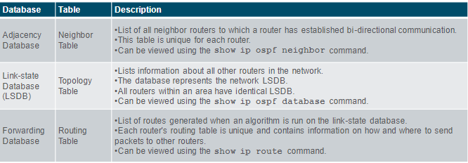

- De router maakt een topologie tabel, door gebruik te maken van de berekingen gebaseerd op Dijkstra Shortest Path first Algorithm (SPF). De SPF algoritme is gebaseerd op de cummulatieve kost om de bestemming te bereiken
- Het SPF algoritme maakt een SPF tree door een router aan de root van de tree te zetten en te berekenen de kost van de root tot de bestemming. De SPF tree wordt dan gebruikt om de beste routes te berekenen. OSPF plaats de beste routes in de forwarding database, die gebruikt worden om de routing tabel aan te maken

### 1.1.3 Link-state Operation
- om routing informatie te behouden, OSPF router compleet een generieke link-state routing proces om een staat van convergentie te bereiken.
- De volgende link-state routing stappen worden gecompleet door een router
  1. Breng buren in de buurt
  2. link-state advertisements uitwisselen
  3. Bouw de linkstatusdatabase
  4. Voer het SPF-algoritme uit
  5. Kies de beste route

### 1.1.4 Single-Area and Multi-Area OSPF
- om een OSPF efficiënter en schaalbaarder te maken, ondersteunt OSPF een hierarchische routing door gebruik te maken van area's.
- een OSPF area is een groep van routers dat dezelfde link-state informatie deelt in hun LSDB.
- OSPF kan op 2 manieren geïmplementeerd worden:
  - **Single-Area OSPF**: alle routers zijn in 1 area, best practice is om area 0 te gebruiken
  - **Multi-Area OSPF**: OSPF wordt geïmplementeerd door gebruik te maken van meerdere area's, in een hiërarchische structuur. Alle areas moeten geconnecteerd worden met de backbone area (area 0). Routers interconnecteren 

### 1.1.5 Multiarea OSPF
- de hiërarchische topologie design opties met multiarea OSPF voordelen geven:
  - **kleinere routing tabellen**: de tabellen zijn kleiner doordat er minder routing tabel entries zijn
  - **verminderde link-state update overhead**
  - **verminderde frequentie van SPF berekeningen**

### 1.1.6 OSPFv3
- OSPFv3 is een nieuwe versie van OSPF die gebruik maakt van IPv6
- OSPFv3 heeft dezelfde functionaliteit als OSPFv2, maar maakt gebruik van IPv6 netwerk laag transport. 

## 1.2 OSPF Packets
### 1.2.1 Types of OSPF Packets
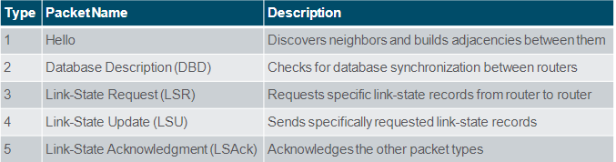

### 1.2.2 Link-State Updates
- LSUs worden ook gebruikt om OSPF routing updates te forwarden
- een LSU pakket kan 11 verschillende types van OSPFv2 LSAs bevatten
- LSU en LSA zijn vaak uitwisselbaar gebruikt, maar de correcte hiërachie is dat LSU pakketten LSA berichten bevatten. 

### 1.2.3 Hello Packet
- De OSPF Type 1 pakket is een Hello packet.
- hello packet wordt gebruikt voor het volgende:
  - OSPF buren ontdekken en buur adjacencies aan te maken
  - het aankondigen van parameters op welke twee routers 
  - het aanmaken van een Designated Router (DR) en Backup Designated Router (BDR) on multiacces netwerken zoals Ethernet. Point-to-point links zijn niet nodig voor DR of BDR

## 1.3 OSPF Operation
### 1.3.1 OSPF Operational States
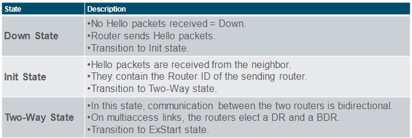
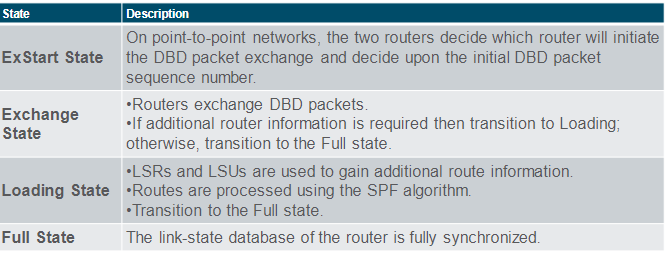

### 1.3.2 Establish Neighbor Adjacencies
- om te bepalen of er een OSPF buur op de link is, the router stuurt een Hello pakket dat een router ID bevat. Het Hello pakket wordt verstuurd naar alle OSPF router
- de OSPF Router ID wordt gebruikt om de OSPF proces uniek te identificeren op iedere router in een OSPF Area. Een router ID is een 32-bit nummer geformateerd zoals een IPv4-adres.
- wanneer een buur OSPF-enabled router ontvangt een Hello pakket met een router ID dat niet in de lijst staat, dan wordt er een adjacency gemaakt met de routing waarvan het hello pakket kwam. 

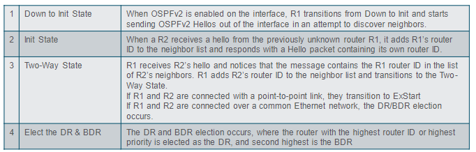

### 1.3.3 Synchronizing OSPF Databases
- Na de Two-Way state, routers . Dit is een 3 stap process:
  - **kies eerste router**: de router met de grootste router ID stuurt een DBD eerst.
  - **wissel DBDs uit**: 
  - **stuur een LSR**
- als alle LSRs uitgewisseld zijn, routers worden als gesynchroniseerd en in full state gezien. Updates (LSUs) worden verstuurd: 
  - wanneer er een verandern voorkomt
  - iedere 30 minuten

### 1.3.4 The Need for a DR
- Multiacces netwerken kan 2 challenges maken voor OSPF door de flooding van LSAs:
  - **het aanmaken van meerdere adjacencies**: een router kan meerdere adjacencies hebben met andere routers in de area
  - **extensive flooding of LSAs**: link-state routers overvloeden hun LSAs iedere keer dat er OSPF geïnitialiseerd wordt, of wanneer er een verandering in topologie is

### 1.3.5 LSA Flooding with a DR
- de verhoging van het aantal routers op een multiaccess netwerk, dit kan ook het aantal LSAs verhogen die uitgewisseld worden. 
- als ieder router in een multiaccess netwerk 
- op multiaccess netwerken, de OSPF selecteert een DR om de collectie- en distributiepunt voor alle LSAs die verzonden en ontvangen worden. Een BDR wordt ook aangeduid voor wanneer de DR faalt. Alle andere routers worden DROTHERs. Een DROTHER is een router dat geen DR noch BDR is. 

# Module 2: Single-Area OSPFv2 Configuration
## 2.1 OSPF Router ID
### 2.1.1 OSPF Reference Topology
### 2.1.2 Router Configuration Mode for OSPF
- door gebruik te maken van commando `router ospf <process-id>` wordt OSPFv2 geïnitialiseerd

### 2.1.3 Router IDs
- een OSPF router ID is een 32-bit nummer, voorgesteld als een IPv4-adres. Het wordt gebruikt om een OSPF router uniek te identificeren. 
- iedere router heeft een router ID nodig om mee te doen in het OSPF domein. Het kan automatisch ingesteld worden door de router of door de administrator.
### 2.1.4 Router ID Order of Precedence
- cisco routers leid het router ID af gebaseerd op 1 van deze 3 criteria, in deze volgorde:
  1. de Router ID is expliciet ingesteld via commando `router-id <router-id>`, dit is aanbevolen methode
  2. de router kiest het hoogste IPv4 adres van een configureerde loopback interface
  3. de router kiest het hoogste actieve IPv4, van een van zijn actieve interfaces. 

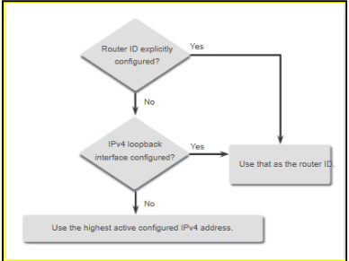

### 2.1.5 Configure a Loopback Interface as the Router ID
### 2.1.6 Explicitly Configure the Router ID
### 2.1.7 Modify a Router ID
- achter dat een router een router ID geselecteerd heeft, laat een actieve OSPF router het niet toe om de Router ID aan te passen tot dat de router gereload is of het OSPF process gereset is.
- het OSPF proces clearen is de aanbevolen methode om de Router ID te resetten

## 2.2 Point-to-Point OSPF Networks
### 2.2.1 The network Command Syntax
- je kan de interfaces specifiëren die aan point-to-point netwerk behoren door het commando network te configureren. Je kan ook OSPF configureren op de interface met het `ip ospf` commando.
- de basis syntax voor het 'network' commando:
  - `network <network-address> <wildcard-mask> area <area-id>`
- het `<network-address> <wildcard-mask>` syntax wordt gebruikt op OSPF aan te zetten op de interfaces
- het `area <area-id>` syntax wordt gebruikt om de OSPF netwerk te specificeren op welke area het OSPF netwerk geplaatst moet worden.

### 2.2.2 The Wilcard Mask
- de wildcard mask is meestal het inverse van het subnet mask die geconfigueerd is op de interface
- de gemakkelijkste methode om de wilcard mask te berekenen is door de network subnet mask te verminderen van 255.255.255.255

### 2.2.3 Configure OSPF Using the network Command
- in het routing configuration mode. Zijn er 2 manieren om

### 2.2.4 Passive Interface
- standaard, OSPF berichten worden verstuurd naar alle OSPF-enabled interfaces. Maar deze berichten moeten enkel maar verstuurd worden naar de interfaces dat geconnecteerd zijn aan andere OSPF-enabled routers
- het versturen van deze berichten hebben een invloed op het LAN op deze 3 manieren:
  - **inefficiënt gebruik van het bandbreedte**: het beschikbare bandbreedte wordt gebruikt voor het vesturen van onnodige berichten
  - **inefficiënt gebruik van resources**: alle apparaten op het LAN moeten de berichten processen en dan het berichten verwijderen
  - **verhoogd Security risk**: zonder de OSPF

### 2.2.5 Configure Passive Interface
- gebruikt het `passive-interface` commando om een interface te configureren als een passieve interface

### 2.2.6 OSPF Point-to-Point Networks
- 

### 2.2.7 Loopbacks and Point-to-Point Networks

## 2.3 Multiaccess OSPF Networks
### 2.3.1 OSPF Network Types
- een andere type dat gebruik maakt van het OSPF is het "multiaccess OSPF network"
- in een multiaccess OSPF netwerk is uniek dat 1 router de controle heeft voor de distributie van LSAs
- de router die de rol heeft, wordt vastgelegd door de netwerk administrator

### 2.3.2 OSPF Designated Router
- in een multiaccess netwerken, OSPF selecteert een DR en BDR. De DR is verantwoordelijk voor het verzameling en versturen van LSAs die verstuurt en ontvangen worden. De DR gebruikt de multicast IPv4-adres 224.0.0.5 die voor alle OSPF routers
- een BDR wordt geselecteerd als de DR faalt. De BDR luister passief en onderhoud een relatie met alle routers. 
- alle andere routers zijn DROTHERs (een router dat noch een DR is noch een BDR is). DROTHERs gebruikt een multiaccess adres 224.0.0.6 om OSPF pakketten te versturen naar de DR en de BDR

### 2.3.3 OSPF Multiaccess Reference Topology
### 2.3.4 Verify OSPF Router Roles
### 2.3.5 Verify DR/BDR Adjacencies
- om de OSPFv2 adjacencies te verifiëren, gebruikt het `show ip ospf neighbor` commando
- de staat van de buren in een multiaccess netwerken is als volgt:
  - **FULL/DROTHER**:
  - **FULL/DR**:
  - **FULL/BDR**:
  - **2-WAY/DROTHER**:

## 2.4 Modify Single-Area OSPFv2
### 2.4.1 Cisco OSPF Cost Metric
- routing protocollen gebruiken een metric die het beste pad vastlegt. OSPF gebruik kost als een metric, een lagere kost toont een beter pad
- De Cisco-kosten van een interface zijn omgekeerd evenredig met de bandbreedte van de
koppel. Daarom duidt een hogere bandbreedte op lagere kosten. De gebruikte formule
om de OSPF-kosten te berekenen is:
  - Cost = referentie bandbreedte / interface bandbreedte
- de referentie bandbreedte is 10^8 (100,000,000), hiervoor is het de formule:
  - Cost = 100,000,000 bps / interface bandbreedte in bps

### 2.4.2 Adjust the Reference Bandwidth
- de kost waarde moet een integer zijn. 
- voor deze reden, alle interfaces die sneller zijn dan Fast Ethernet zullen dezelfde kost waarde hbebn van 1 als een Fast Ethernet interface
- om OSPF te assisteren bij het kiezen voor het correcte pad, de reference bandbreedte veranderd worden naar een hogere waarde om de netwerken te ondersteunen die links hebben die sneller zijn dan 100 Mbps
- het veranderen van de referentie bandbreedte heeft geen invloed op de bandbreedte capaciteit op de link. Het heeft enkel invloed op de berekening die de metric bepaald
- om de referentie bandbreedte te veranderen, gebruik commando `auto-cost reference-bandwidth <bandwidth>` van de router configuration
  - dit commando kan gebruikt worden op elke router van het OSPF domein
- een andere optie om de cost te veranderen op 1 specifieke interface, gebruik commando `ip ospf cost <cost>`
- het is belangrijk om de configuratie op alle routers in het OSPF domein uit te voeren

### 2.4.3 OSPF Accumulates Cost
- de kost van een OSPF route is de geaccumuleerde waarde van 1 router naar het bestemmings netwerk

### 2.4.4 Manually Set OSPF Cost Value
- redenen om de cost value manueel in te stellen:
  - de administrator wil de pad selectie beïnvloeden in de OSPF 
  - connectie's naar apparaten van een andere verkoper, die een andere formule gebruiken voor het berekenen van de OSPF kost

### 2.4.5 Test Failover to Backup Route
- 

### 2.4.6 Hello Pakcets Intervals
- OSPFv2 Hello pakketten worden verstuurd naar het multicast adres 224.0.0.5 (alle OSPF routers) iedere 10 seconden. Dit is een default timer waarde op de multiacces en point-to-point netwerken
- de Dead interval is de periode dat de router wacht om een hello pakket te ontvangen voordat hij zijn buur als down verklaart. Als de dead interval vervalt voordat de router een hello pakket ontvangt, dan zal OSPF de buur verwijderen uit de link-state database (LSDB). Cisco's default is 4x het hello interval = 40 seconden

### 2.4.7 Verify Hello and Dead Intervals
- de OSPF Hello en Dead interval kunnen aangepast worden per interface
- de OSPF intervallen moeten matchen anders doet er geen neighbor adjacency voor.
- om de intervallen te verifiëren, gebruik commando `show ip ospf interface`
- gebruik het commando `show ip ospf neighbor` om de Dead time te zien aftellen van 40, standaard wordt deze waarde gerefreshed iedere 10 seconden

### 2.4.8 Modify OSPFv2 Intervals
- Het is misschien handig om de OSPF timers te veranderen zodat de router sneller een fout in het netwerk zien. Maar om dit verhoogd wel het netwerkverkeer
- het veranderen van de intervallen gebeurt met volgende commando's
  - `ip ospf hello-interval <seconds>`
  - `ip ospf dead-interval <seconds>`
- gebruikt volgende commando's om de intervallen te veranderen naar de standaard waarden:
  - `no ip ospf hello-interval`
  - `no ip ospf dead-interval`

## 2.5 Default Route Propagation
### 2.5.1 Propagate a Default Static Route in OSPFv2
- om een Default route te propageren, moet de router als volgende geconfigueerd zijn:
  - een default static route, door volgende commando `ip route 0.0.0.0 0.0.0.0 <next-hop-address | exit-intf>`
  - de `default-information originate`commando, dit stelt de router in als de brond van de default route informatie

## 2.6 Verify Single-Area OSPFv2
### 2.6.1 Verify OSPF Neighbors

# Module 4: ACL Concepts
## 4.1 Purpose of ACLs
### 4.1.1 What is an ACL?
- een ACL is een serie van IOS commando's dat gebruikt worden om pakketten te filteren obv informatie die gevonden wordt in de pakket header
- standaard, een router heeft geen ACL die geconfigueerd is.
- Wanneer een ACL aan een interface wordt geplaatst, dan zal de router de extra taak van alle netwerk pakketten te evalueren wanneer deze door de interface gaan. 
  - een ACL is een sequentiële lijst met verklaringen van toestemming of weigering, ook wel Access Control Entries (ACEs) genoemd.
- deze zijn de taken die een router moeten hebben om het gebruik van ACLs toe te staan:
  - het limiteren van netwerkverkeer om netwerkperformantie te verbeteren
  - netwerkverkeer flow geven
  - een basislevel aan netwerktoegang beveiliging
  - netwerkverkeer filteren obv verkeertype
  - host screenen om toegang te geven en verbieden van de netwerk services
  - voorrang geven aan bepaalde classes van het netwerkverkeer

### 4.1.2 Packet Filtering
- pakket filtering controleert te toegang tot een netwerk door het analyseren van het inkomende en/of uitgaande pakketten of ze te discarden obv bepaalde criteria's
- pakket filtering kan zowel op laag 3 als 4
- Cisco router ondersteunen twee types van ACLs:
  - **Standard ACLs**: ACLs filteren alleen laag 3, gebruik makend van het bron IPv4 adres
  - **Extended ACLs**: ACLs filteren op Laag 3, gebruik makend van het bron als bestemmings IPv4 adres. Maar kunnen ook gefilterd worden op laag 4, door gebruik te maken van TCP, UDP poorten en de optionele protcol type informatie voor betere controle

### 4.1.3 ACL Operation
- ACLs definiëren en set aan regels dat verbeterde controle voor pakketten in binnen komen in de inbound interface, pakketten die door de router gaan en pakketten die via de outbound interface terug weggaan
- ACLs kunnen ingesteld worden op inbound en outbound netwerkverkeer
- 2 soorten ACLs:
  - **Inbound ACL**: filtert pakketten voordat ze gerouteerd zijn naar de outbound interface. Een inbound ACL is efficiënt omdat het helpt de overhead van de routing lookup als het pakket gediscard wordt.
  - **OUTbound ACL** filtert pakketten achter dat ze gerouteerd zijn
- Wanneer een ACL is ingesteld op een interface, dan volgt het specifieke operating procedure. Deze procedure, wanneer een inbound standaar IPv4 ACL is geconfigureerd, is:
  - de router haalt het bron IPv4-adres uit de pakket header.
  - de router start aan het beginn van de ACL en vergelijkt het bron IPv4-adres met de ACE in een sequentiële volgorde
  - wanneer er een match is, wordt de instruction uitgevoerd door de router. Oftewel toegang verlenen of verbieden. De overige ACEs in de ACL worden niet meer geanalyseerd
  - als het bron IPv4 adres niet match met een ACE uit de ACL, wordt het pakket gediscard omdat

## 4.2 Wildcard Masks in ACLs
### 4.2.1 Wilcard Mask Overview
- een wildcard mask is vergelijkbaar tot een subnetmask, deze twee gebruiken ANDing process om te identificiëren welke bit in een IPv4-adres matchen.
- Maar bij wildcard mask, 0 = match en 1 = non-match
- een IPv4 ACE gebruikt een 32-bit wildcard mask om vast te leggen welke bit van het adres moeten worden gecontroleerd
- Wildcard mask gebruikt volgende regels:
  - Wildcard mask bit 0: match de bitwaarde in het adres
  - Wildcard mask bit 1: negeer de bitwaarde in het adres

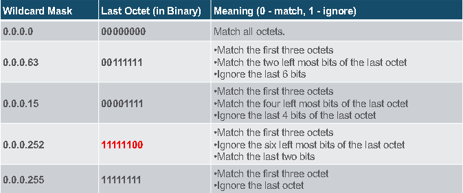

### 4.2.2 Wildcard Mask Types
- Wildcard to Match a Host
- Wildcard Mask to Match an IPv4 Subnet
- Wildcard Mask to Match an IPv4 Address Range

### 4.2.3 Wildcard Mask Calculation
- een shortcut method om de wildcard mask te berekenen is 255.255.255.255 verminderen met de subnetmask

### 4.2.4 Wildcard Mask Keywords
- de Cisco IOS geeft 2 sleutelwoorden voor het gebruik van wildcard masking:
  - **host**: een 0.0.0.0 mask
  - **any**: een 255.255.255.255 mask

## 4.3 Guidelines for ACL Creation
### 4.3.1 Limited Number of ACLs per Interface
- er zijn een beperkt aantal ACLs per router interface
- een router interface kan maximaal:
  - 1 outbound IPv4 ACL
  - 1 inbound IPv4 ACL
  - 1 outbound IPv6 ACL
  - 1 inbound IPv6 ACL

### 4.3.2 ACL Best Practices

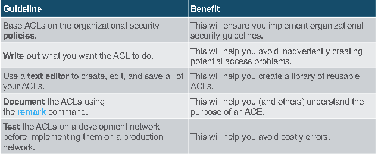

## 4.4 Types of IPv4 ACLs
### 4.4.1 Standard and Extended ACLs
- Er zijn 2 types van IPv4 ACLs:
  - **Standard ACLs**: deze geven pakketten toegang of verbied toegang gebaseerd op het bron IPv4-adres
  - **Extended ACLs**: deze geven pakketten toegang of verbied toegang gebaseerd op zowel het bron als bestemmings IPv4-adres, protocol type, bron- en bestemmings TCP- en UDP poorten en meer. 

### 4.4.2 Numbered and Named ACLs
- **Numbered ACLs**
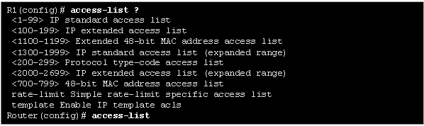
- **Named ACLs**:
  - 

### 4.4.3 Where to Place ACLs
- elke ACL moet geplaatst worden op een plaats waar het het meeste invloed heeft op de efficiëntie.
- Extended ACL moeten zo dicht mogelijk geplaatst worden op de bron van het verkeerd dat gefilterd moet worden
- Standard ACLs moeten zo dicht mogelijk geplaatst worden aan de bestemming

### 4.4.4 Standard ACL Placement Example
### 4.4.5 Extended ACL Placement Example

# Module 5: ACLs for IPv4 Configuration
## 5.1 Configure Standard Standard IPv4 ACLs
### 5.1.1 Create an ACL
- alle access control lists (ACLs) moeten ingepland worden. Wanneer je een complexe ACL configueerd, kun je deze dingen doen:
  - gebruik maken van een tekst-editor
  - toevoegen van de IOS configuration commando's
  - opmerkingen toevoegen
  - copy paste de commando's op het apparaat
  - altijd eerst de ACL blijven testen

### 5.1.2 Numbered Standard IPv4 ACL Syntax
- het gebruik van `access-list` commando
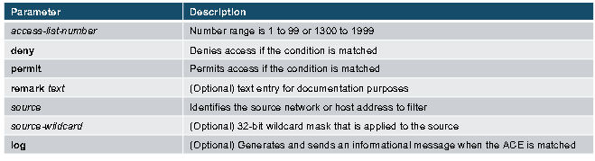
- gebruik het commando `no access-list <access-list-number>` om een ACL te verwijderen

### 5.1.3 Named Standard IPv4 ACL Syntax
- om een named standard ACL aan te maken, gebruik het commando `ip access-list standard`
  - ACL namen moeten alpha-numeriek, case senstive en uniek zijn.
  - 

### 5.1.4 Apply a Standard IPv4 ACL
- achter dat een IPv4 ACL geconfigueerd is, moeten deze gelinkt worden aan een interface of feature.
  - het `ip access-group` commando wordt gebruikt om een numbered of named standard IPv4 ACL toe te wijzen aan een interface
  - om een ACL te verwijderen van een interface, `no ip access-group` in de interface configuration

### 5.1.5 Numbered Standard ACL Example
### 5.1.6 Named Standard ACL Example

## 5.2 Modify IPv4 ACLs
### 5.2.1 Two Methods to Modify an ACL
- de twee manieren om een ACL te wijzigen zijn:
  - gebruik maken van een tekst-editor
  - door gebruik te maken van de sequence nummer

### 5.2.2 Text Editor Method

### 5.2.3 Sequence Number Method
- een ACL ACE kan verwijderd of toegevoegd worden door gebruik te maken van de ACL Sequence nummer:
  - gebruik het commando `ip access-list standard` om een ACL aan te passen
  - statements kunnen niet overschreven worden, met het bestaande sequentie nummer. Eerst moet de bestaande statement verwijderd worden met volgend commando `no 10`

### 5.2.4 Modify a Named ACL Example
### 5.2.5 ACL Statistics
- het commando `show access-lists` toont de statistieken voor iedere statement dat gematch heeft
  - gebruik het commando `clear access-list coutners` om de statistieken te verwijderen

## 5.3 Secure VTY Ports with a Standard IPv4 ACL
### 5.3.1 The Access-class Command
- een standaard ACL kan de remote administratieve toegang naar een apparaat beveiligen door de VTY lijnen als volgt te implementeren:
  - maak een ACL om te identificeren welke administratieve host er toegestaan worden om de remote access
  - apply de ACL op het inkomende verkeer op de vty lijnen door gebruik te maken van het `access-class` line commando

### 5.3.2 Secure VTY Access Example
### 5.3.3 Verify the VTY Port is Secured

## 5.4 Configure Extended IPv4 ACLs
### 5.4.1 Extended ACLs
- Extended ACLs zorgen voor een grotere mate van controle. Ze kunnen filteren op bron adres, bestemmingsadres, protocol (IP, TCP, UDP, ICMP) en poort nummer
- Extende ACLs kunnen als volgt gemaakt worden:
  - **Numbered Extended ACL**: door gebruik te maken van het globale commando `access-list <access-list-number>`
  - **Named Extended ACL**: door gebruik te maken van het commando `ip access-list extended <access-list-name>`

### 5.4.2 Protcols and Ports
-
### 5.4.3 Protocols and Port Numbers Configuration Examples
### 5.4.4 Apply a Numbered Extended IPv4 ACL

### 5.4.5 TCP Established Extended ACL
- TCP kan ook basis statefull firewall diensten aanbieden door gebruik te maken van de TCP established keyword
  - de established sleutelwoorden enablen

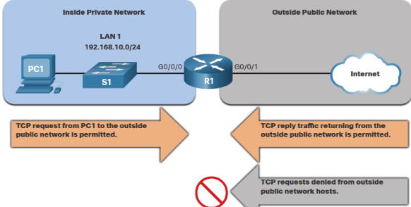

### 5.4.6 Named Extended IPv4 ACL Syntax
- het commando `ip access-list extended <access-list-name>` wordt gebruikt om een named extended ACL aan te maken

### 5.4.7 Named Extended IPv4 ACL Example
### 5.4.8 Edit Extended ACLs
- een extended ACL kan gewijzigd worden door gebruik te maken van een tekst-editor, wanneer er veel veranderd moeten worden. Maar kan ook als er maan 1 of 2 ACEs gewijzigd moeten worden, gedaan worden door gebruik te maken van de sequence nummer

### 5.4.9 Another Extended IPv4 ACL Example
### 5.4.10 Verify Extended ACLs
- `show ip interface`
- `show access-lists`

# Module 6: NAT for IPv4
## 6.1 NAT Characteristics
### 6.1.1 IPv4 Address Space
- Netwerken worden geïmplementeerd door gebruik te maken van private IPv4 adressen
- private IPv4 adressen kunnen niet gerouteerd worden over het internet en worden enkel maar gebruikt in organisatie om apparaten toe te laten om met elkaar lokaal te communiceren
- om een apparaat met een privaat IPv4 adres toe te laten om te kunnen communiceren met andere apparaten, moet het private adres eerste vertaald worden naar een publiek adres.
- Network Address Translation (NAT) laat de vertaling van private adressen naar publieken adressen toe.

### 6.1.2 What is NAT?
- het primaire gebruik van NAt is 
- NAT laat netwerken toe om private IPv4 adressen intern te gebruiken en ze te vertalen naar een publiek adres wanneer dit nodig is
- een NAT router functioneert meestal op de rand van een stub netwerk
- wanneer een apparaat binnen een stub netwerk wil communiceren met een apparaat dat zich buiten het netwerk bevindt, wordt het pakket verstuurd naar de grensrouter die NAT processen uitvoert, deze vertaalt het intern privaat adres van het apparaat naar een publiek, extern, routbaar adres

### 6.1.3 How NAT Works
- PC1 wil communiceren met een webserver die zich buiten het intern netwerk bevindt, deze webserver heeft een publiek adres 209.165.201.1:
  1. PC1 stuurt een pakket die geaddresseerd is naar de webserver
  2. R2 ontvangt het pakket en leest het bron IPv4 adres uit en beslist of het moet vertaald worden.
  3. R2 voegt mapping van het lokaal naar globaal adres toe aan de NAT tabel
  4. R2 stuurt het pakket met het vertaalde bron adres naar de bestemming
  5. de webserver reageert met een pakket die geaddresseerd is aan de inside global address van PC1 (209.165.200.226)
  6. R2 ontvangt het pakket met het bestemmingsadres 209.165.200.226. R2 checkt in de NAT tabel en vindt een entry voor deze mapping. R2 gebruikt deze info en vertaalt de inside global adress (209.165.200.226) naar het inside global address (192.168.10.10) en stuurt het pakket door naar PC1

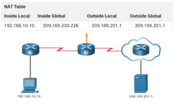

### 6.1.4 NAT Terminology
- NAT heeft 4 types van adressen:
  - Inside Global Address
  - Inside Local Address
  - Outside Global Address
  - Outside Local Address
- NAT terminologie wordt bekijken uit het perspectief van het apparaat met het vertaalde adres:
  - inside address: het adres van het apparaat dat wordt vertaald door de NAT
  - outside address: het adres van het bestemmingsapparaat
  - local address: een adres dat voorkomt in het midden van het netwerk
  - global address: een adres dat buiten het netwerk voorkomt

## 6.2 Types of NAT
### 6.2.1 Types of NAT
- er zijn 3 types NAT:
  - Static NAT
  - Dynamic NAT
  - Port Address Translation (PAT) of NAT overload

### 6.2.2 Static NAT
- static NAT maakt gebruik van 1-to-1 mapping van lokale en globale adressen, die geconfigueerd zijn door de netwerk administrator die constant blijven
- een static NAT is nuttig voor een webserver of apparaten die een consiquent adres moeten hebben. 
- het is ook handig voor apparaten die beschikbaar moeten zijn voor bepaald personeel wanneer ze offsite zijn, maar niet voor ieder publiek.

### 6.2.3 Dynamic NAT
- Dynamic NAT maakt gebruik van een pool van publieke adressen, een wijst ze aan met een first-come, first-served basis
- wanneer een inside apparaat toegang aanvraagt om te kunnen communiceren met een outside netwerk, zal dynamic NAT een publiek IPv4 geven van de pool aan het apparaat
- de andere adressen uit de pool blijven steeds beschikbaar voor gebruik

### 6.2.4 Port Address Translation (PAT)
- PAT ook wel NAT overload genoemd, maps verschillende private ipv4 adressen aan 1 publiek ipv4 adres
- wanneer de NAT router een pakket ontvangt van een client, maakt hij gebruikt van de bronpoort nummer om te bepalen welk NAT translation ze moet gebruiken
- PAT verzekert dat apparaten steeds een verschillend poort nummber gebruiken voor iedere sessie met een server om het internet

### 6.2.5 Next Available Port

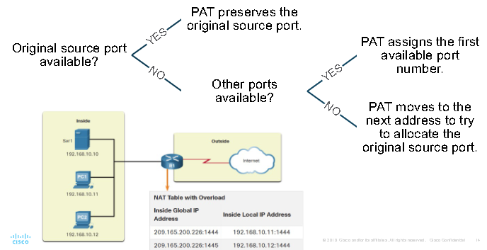

### 6.2.6 NAT and PAT Comparison
- een overzicht over de verschillen tussen PAT en NAT:
  - NAT: veranderd enkel maar het IPv4 adres
  - PAT: veranderd zowel het IPv4 adres als de poort nummer

## 6.3 NAT Advantages and Disadvantages
### 6.3.1 Advantages of NAT
- NAT geeft bepaalde voordelen:
  - NAT behoudt het wettelijk geregistreerde adresseringsschema door de
  privatisering van intranetten.
  - NAT bewaart adressen door middel van multiplexing op poortniveau van de toepassing.
  - NAT vergroot de flexibiliteit van aansluitingen op het openbare netwerk.
  - NAT zorgt ervoor dat het bestaande privé IPv4-adresschema behouden blijft, terwijl:
  gemakkelijke verandering naar een nieuw omroepschema.
  - NAT verbergt de IPv4-adressen van gebruikers en andere apparaten

### 6.3.2 Disadvantages of NAT
- NAT heeft natuurlijk ook nadelen:
  - NAT verhoogt delays.
  - Geen end-to-end verbindingen mogelijk, dus:
    - NAT bemoeilijkt het gebruik van tunnelingprotocollen, zoals IPsec.
    - Services die de initiatie van TCP-verbindingen van het externe netwerk vereisen, of
    stateless protocollen, zoals die met UDP, kunnen worden verstoord.

## 6.4 Static NAT
### Static NAT Scenario