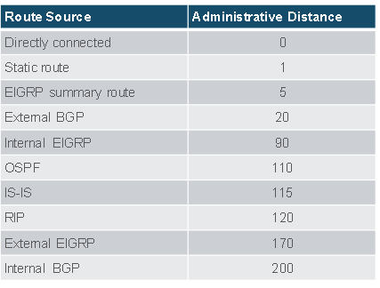

# Computer Networks III
| Inhoudstafel  |
| :---  |
| [SRWE](#srwe)
| 14.[Routing Concepts](#module-14-routing-concepts)    |
| 15.[Ip Static Routing](#module-15-ip-static-routing)  |
| 16.[Troubleshoot Static and Default Routes]() |
| [ENSA]()  |
| 1.[Single-Area OSPFv2 Concepts]() |
| 2.[Single-Area OSPFv2 Configuration]()    |
| 3.[Network Security Concepts]()   |
# SRWE
# Module 14: Routing Concepts
## 14.1 Path Determination
### 14.1.1 De 2 functies van een Router
- De 2 primaire functies van een router:
  - het beste pad vastleggen voor het forwarden van pakketten obv de informatie uit de routing tabel
  - het forwarden van de pakketten naar hun bestemming

### 14.1.3 Het beste pad is gelijk aan het langste match
- Het beste pad is de langste match in de routing tabel
- de routing tabel bevat de route entries d

### 14.1.6 Het opmaken van de Routing Tabel
- Direct geconnecteerde netwerken:
- Remote netwerken
- Standaard route

## 14.2 Packet Forwarding
### 14.2.1 Packet Forwarding Decision Process
1. De data link frame met de geëncapsuleerde IP pakket komt aan op de ingress interface
2. De router examineert de bestemmings IP adres in de pakket header en bekijkt de IP routing tabel
3. De router zoekt de langste match prefix in de tabel
4. De router encapsuleert de pakket in een data link frame en forward dit via de egress interface
   
- achter het beslissen van het beste pad, kan de router het volgende doen
  - Het pakket forwarden op een apparaat die direct geconnecteerd is het op netwerk
  - het pakket forwarden naar een Next-Hop Router
  - Het pakket droppen - er is geen match in de Routing Tabel

### 14.2.2 Packet Forwarding Mechanisms
- de primaire verantwoordelijkheid van de pakket forwarding functie is het encapsuleren van pakketten in juist appro data link frame type voor de uitgaande interface
- De Router ondersteunt de volgende 3 pakket forwarding mechanismen
  - Process switching
  - Fast switching
  - Cisco Express Forwarding (CEF)
- **Process Switching**:
  - een ouder pakket forwarding mechanisme
  - wanneer een pakket arriveert op een interface, wordt deze doorgestuurd naar een control paneel waar de CPU het bestemmingsadres matcht met een entry in zijn Routing Tabel. Daarna bepaald hij de exit interface en forward het pakket.
  - De router doet dit voor alle pakketten, zelfs als de bestemming in dezelfde stream aan pakketten zit.

- **Fast Switching**:
  - ouder maar beter mechanisme dan Process Switching
  - gebruikt een fast-switching cache om de next-hop informatie in op te slaan
  - wanneer een pakket arriveert op een interface, dan wordt het doorgestuurd naar de control plane waar de CPU zoekt voor een match in de fast-switching cache.
  - als het niet hier is, dan wordt het geprocess-switched

- **Cisco Express Forwarding (CEF)**:
  - het meeste recente en standaard Cisco IOS packet forwarding mechanisme
  - CEF maakt een Forwarding Information Base (FIB) en een aangrenzende tabel
  - de tabellen entries zijn niet packet-triggered zoals bij Fast Switching => maar change-triggerd (zoals wanneer een verandering is in de netwerk topologie)
  - wanneer een netwerk convergeerd, de FIB en de aangrenzende tabel bevat alle informatie dat een router zou moeten mee rekening houden wanneer hij een pakket zou forwarden
  

## 14.3 Basic Router Configuration Review
### 14.3.1 Topologie
### 14.3.2 Configuratie commando's

### 14.3.3 Verificatie Commando's
- `show ip interface brief`
- `show running-config interface <interface-type number>`
- `show interfaces`
- `show ip interface`
- `show ip route`
- `ping`

### 14.3.4 Filter commando output
- filterting commando's kunnen gebruikt worden om bepaalde uitput te krijgen, hiervoor hebt je | pipe karakter nodig
- bepaalde filter parameters
  - section
  - include
  - exclude
  - begin
## 14.4 IP Routing Table
### 14.4.1 Route Sources
- een routing tabel bevat een lijst aan routes 
- de bron van deze informatie komt van:
  - Direct geconnecteerde netwerken
  - statische routes
  - dynamische routing protocollen
- de bron van iedere route in de tabel is geïdentificeerd met een code:
  - **L**: identificeert een adres vastgelegd aan een router interface
  - **C**: identificeert een direct geconnecteerd netwerk
  - **S**: identificeert een statische route die gemaakt is om een specifiek netwerk te reachen
  - **O**: identificeert een dynamisch geleerd netwerk van een andere router door gebruik te maken van OSPF routing protocol
  - *: deze route is een kandidaat voor een standaard route

### 14.4.2 Routing tabel principes
- 3 routing table principes
  - iedere router maakt een beslissing alleen, gebaseerd op de informatie dat hij heeft in zijn eigen routing tabel
  - de informatie in een routing tabel van 1 router moet niet direct dezelfde zijn als de routing tabel van een andere router
  - routing informatie over een pad 

### 14.4.3 Routing Table Entries
1. **Route Source**: geeft weer hoe de route geleerd geweest is
2. **bestemming netwerk (prefix en prefix lengte)**: geeft het adres weer van het remote netwerk
3. **administratieve afstand**: geeft de betrouwbaarheid weer van de route bron. Hoe lager de waarde geeft de preferred route bron weer. deze is gebaseerd op welke routing protocol er gebruikt werd
4. **Metric**: geeft de waarde voor . De berekening is gebaseerd op de kost van een bepaalde route
5. **Next-hop**: het ip adres voor de volgende router naar welk het pakket 
6. **Route timestamp**: geeft de tijd weer sinds wanneer de route aangeleerd werd
7. **exit interface**: geeft de egress interface weer dat gebruitk wordt voor uitgaande pakketten om hun finale bestemming te bereiken

### 14.4.4 Directly Connected Networks
- voordat een router kan leren over een remote netwerk, moet deze minstens 1 actieve interface hebben met een IP adres en subnet mask
- dit staat bekend als een direct verbind netwerk of direct geconnecteerde route
- routers kunnen een direct verbinde route toevoegen aan zijn routing tabel wanneer een interface geconfigueerd is met een IP adres en wanneer deze actief is
- heeft als status code 'C'
- de routing tabel kan ook een lokale route bevatten, deze wordt aangeduid met de status code 'L'
- voor IPv4 lokale routes is de prefix lengte /32 en voor IPv6 lokale routes is de prefix lengte /128, dit betekend dat de bestemmings ip adres van het pakket altijd gelijk moet zijn aan de bits in de lokale route

### 14.4.5 Statische routes
- statische routes hebben 2 primaire gebruiken
  - het geeft een gemakkelijk onderhoud van de routing tabel in kleinere netwerken
  - het geeft route van en naar stub netwerken. Een stub netwerk is een netwerk die bereikt wordt door 1 route, en de router heeft enkel maar 1 buur
  - het gebruikt een single default route om het pad naar elk netwerk dat niet 
### 14.4.6 Statische routes in de IP Routing tabel

### 14.4.7 Dynamic Routing Protocols
- Dynamic Routing Protocols worden gebruikt door routers om informatie over de bereikbaarheid en de status van remote networks te delen
- DRP doen verschillende activiteiten zoals:
  - network discovery
  - maintaining routing tables
  - ....
### 14.4.8 Dynamic Routes in the Routing Table

### 14.4.9 Default Route
- De default route specificeert een next-hop router die gebruikt moet worden wanneer de routing table niet de specifieke route heeft dat overeenkomt met de bestemming IP adres
- deze kan ofwel een statische route zijn of een route die aangeleerd werd door Dynamic Routing Protocol
- een default route heeft een IPv4 route entry van 0.0.0.0/0 of een IPv6 route entry van ::/0
### 14.4.10 Structure of an IPv4 Routing Table

### 14.4.11 Structure of an IPv6 Routing Table

### 14.4.12 Administrative Distance
- een route entry voor een specifiek netwerk adres kan alleen maar 1 keer voorkomen in een Routing table
- Cisco IOS maakt gebruikt van Administrative Distance (AD) om te bepalen welke route er geïnstalleerd zal worden in de IP routing table. De AD toont de betrouwbaarheid van de route
- hoe lager de AD, hoe betrouwbaarder de route is

## 14.5 Static and Dynamic Routing
### 14.5.1 Static of Dynamic?
- de meeste netwerken gebruiken een combinatie van de twee
- **Static Routes**
  - Static routes worden het meest gebruikt in volgende scenario's
    - als een default route om pakketten te forwarden naar de ISP
    - voor routes buiten het routing domein en die niet aangeleerd zijn door dynamic routing protocol
    - wanneer een netwerk admin een 
    - voor routing tussen stub netwerken
- **Dynamic Routing**
  - Dynamic routing protocols worden geïmplementeerd in ieder type van netwerk dat bestaat uit 1 of meerdere routers
  - Dynamic Routing protocols zijn schaalbaar en automatisch 
  - Deze worden gebruikt in volgende scenario's:
    - in netwerken dat bestaan uit meer dan 1 routers
    - wanneer er een verandering in de netwerk topologie is
    - voor schaalbaarheid

### 14.5.2 Dynamic Routing Evolution
- Dynamic Routing protocols worden al in netwerken gebruikt sinds 1980s

- 2 soorten
  - IGPs(Interior Gateway Protocols): wordt gebruikt voor het uitwisselen van informatie in 1 routing domein die beheerd wordt door 1 organisatie
  - EGP(Exterior Gateway Protocol): wordt gebruikt voor het uitwisselen van informatie tussen meerdere en verschillende organisatie's, die bekend staan als autonomous systems (AS)
    - wordt vaak gebruikt door ISP om pakketten over het internet te versturen

### 14.5.3 Dynamic Routing Protocol Concepts
- een routing protocol is een set van processen, algoritmen en berichten dat gebruikt wordt voor het uitwisselen van routing informatie en het vullen van de routing table met de keuze voor het beste pad
- de bedoeling van dynamic routing protocols zijn:
  - het ontdekken van remote netwerken
  - het onderhouden van routing informatie
  - het kiezen van het beste pad naar bestemming netwerken
  - de mogelijkheid voor het vinden van een nieuw beste pad als het huidige pad niet meer beschikbaar is
- de belangrijkste onderdelen van dynamic routing protocols zijn:
  - **data structuren**: RP gebruiken vaak tabellen of databanken voor hun operaties. Deze worden opgeslagen in het RAM
  - **Routing Protocol messages**: RP gebruiken verschillende soorten berichten om hun taken te voldoen
  - **algoritme**: een algoritme is een lijst aan steppen om een taak te vervolledigen. RP gebruikt algoritmen om hun taken te doen

### 14.5.4 Best Path
- Het beste pad wordt geselecteerd door een RP gebaseerd op de waarde of metric dat gebruikt wordt om de afstand te bepalen om een netwerk te bereiken

### 14.5.5 Load Balancing
- wanneer een router 2 of meerdere paden heeft met dezelfde metric kost, dan forward de router de pakketten via de beide paden op hetzelfde moment. Dit noemt equal cost load balancing
  - de routing tabel bevat de single destination network, maar heeft meerde uitgang interfaces
  - als het correct geconfigueerd is, load balancing kan effectiviteit en performantie verbeteren van het netwerk
  - equal cost load balancing wordt automatisch geïmplementeerd door dynamic routing protocol. Het wordt aangezet met static routes wanneer er meerdere static routes naar hetzelfde netwerk zijn

# Module 15: IP Static Routing
## 15.1 Static Routes
### 15.1.1 Types of Static Routes
- Static routes worden vaak geïmplementeerd op een netwerk, dit is zo zelfs als er een dynamic routing protocol geconfigueerd is
- static routes kunnen geconfigueerd worden voor IPv4 of IPv6. Beide protocollen supporten de volgende types van static routes:
  - standard static route
  - default static route
  - floating static route
  - summary static route

### 15.1.2 Next-Hop Options
- Wanneer een static route geconfigueerd wordt, kan de next hop geïdentificeerd worden door een IP adres, uitganginterface of beide.
- Hoe de bestemming is gespecificeerd, maakt 1 van de volgende types van static routes:
  - **Next-Hop Route**: alleen een next-hop ip adres is meegegeven
  - **Directly connected static route**: alleen de uitgangsinterface
  - **fully specified static route**: beide

### 15.1.3 IPv4 Static Route Command
- de IPv4 static routes worden geconfigueerd door het globale commando:
  - `ip route <network-address> <subnet-mask>`

### 15.1.4 IPv6 Static Route Command
- IPv6 static routes worden geconfigueerd door het globale commando:
  - `ipv6 route <ipv6-prefix/prefix-length>`

### 15.1.5 Dual-Stack Topology

## 15.2 Configure IP Static Routes
### 15.2.1 IPv4 Next-Hop Static Route
